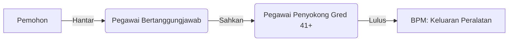

# MOTAC Integrated Resource Management System  
**Design Language Documentation Version 1.0 | For Information Management Division (BPM)**

---

## 1. Core Design Principles

### 1.1 Professionalism & Trustworthiness (Imej Rasmi dan Berwibawa)
- **Modern Government Aesthetic:** Clean, uncluttered interfaces with official MOTAC branding.
- **Authority Through Consistency:** Predictable patterns and strict adherence to MOTAC visual standards.
- **Data Integrity Focus:** Clear audit trails and verification mechanisms.

### 1.2 User-Centricity & Clarity (Mesra Pengguna dan Jelas)
- **Bahasa Melayu First:** Primary UI language with a contextual English option.
- **Progressive Disclosure:** Complex workflows are broken into manageable steps.
- **Zero Ambiguity:** Mandatory fields are explicitly marked with red asterisks (*).

### 1.3 Efficiency & Productivity (Kecekapan dan Produktiviti)
- **Role-Optimized Workflows:** Tailored interfaces for Pemohon, Penyokong, and BPM Staff.
- **One-Action Access:** Critical tasks are reachable in ≤2 clicks from the dashboard.
- **Smart Defaults:** Pre-filled fields based on user role and context.

### 1.4 Cultural Context & Accessibility (Konteks Budaya dan Kebolehcapaian)
- **Formal Tone:** Respectful Bahasa Melayu for all system communications.
- **WCAG 2.1 AA Compliance:** 4.5:1 contrast ratio, keyboard navigability.
- **Malaysian Work Patterns:** Supports official working hours and approval chains.

---

## 2. Visual Foundation

### 2.1 Color Palette

| Role         | Light Mode         | Dark Mode         | Usage                        |
|--------------|--------------------|-------------------|------------------------------|
| Primary      | #0055A4 (MOTAC Blue) | #3D8FD1           | Primary buttons, active states|
| Secondary    | #8C1D40 (Maroon)    | #A9496B            | Secondary actions, alerts     |
| Background   | #F8F9FA             | #121826            | Main content area             |
| Surface      | #FFFFFF             | #1E293B            | Cards, form panels            |
| Critical     | #DC3545             | #F87171            | Errors, destructive actions   |
| Success      | #28A745             | #4ADE80            | Completed actions             |

### 2.2 Typography

- **Primary Font:** Noto Sans (Google Fonts)
- **Scale:**
  - h1: 1.75rem (28px) • Semibold
  - h2: 1.5rem (24px) • Semibold
  - h3: 1.25rem (20px) • Medium
  - Body: 0.875rem (14px) • Regular
  - Labels: 0.75rem (12px) • Medium
- **Bahasa Melayu Specifics:**
  - Line-height: 1.6 for optimal readability.
  - Avoid all-caps except for acronyms.

### 2.3 Spacing System

- **4px Baseline Grid**
- **SCSS Example:**
  ```scss
  $spacer: 4px;
  $spacers: (
    0: 0,
    1: $spacer, // 4px
    2: $spacer * 2, // 8px
    3: $spacer * 3, // 12px
    4: $spacer * 4, // 16px
    5: $spacer * 6, // 24px
    6: $spacer * 8, // 32px
  );
  ```

### 2.4 Iconography

- **Set:** Bootstrap Icons v1.8+
- **Usage Principles:**
  - Always paired with Bahasa Melayu labels.
  - Standard sizes: 16px (inline), 24px (actions).
  - Semantic coloring (e.g., red for delete).

---

## 3. Component Library

### 3.1 Navigation

#### Vertical Side Navigation
```html
<nav class="app-sidebar bg-surface">
  <div class="sidebar-header">
    
  </div>
  <ul class="nav flex-column">
    <li class="nav-item active">
      <a class="nav-link" href="#">
        <i class="bi bi-house-door"></i> Utama
      </a>
    </li>
    <li class="nav-item">
      <a class="nav-link" href="#">
        <i class="bi bi-laptop"></i> Pinjaman ICT
      </a>
    </li>
  </ul>
</nav>
```

#### Top Action Bar
- MOTAC logo lockup (40px height)
- Language toggle: BM/EN with flag icons
- User profile with role badge

### 3.2 Data Inputs

#### Form Field Standards
```html
<div class="form-group">
  <label for="namaPenuh">
    Nama Penuh <span class="text-danger">*</span>
  </label>
  <input type="text" class="form-control" id="namaPenuh" placeholder="Contoh: Ahmad bin Ismail" aria-describedby="namaHelp">
  <small id="namaHelp" class="form-text">Seperti dalam kad pengenalan rasmi</small>
</div>
```

#### Approval Workflow


### 3.3 Status Indicators

| State     | Icon         | Color     | Label        |
|-----------|--------------|-----------|-------------|
| Pending   | bi-clock     | $warning  | Menunggu    |
| Approved  | bi-check-circle | $success | Diluluskan  |
| Rejected  | bi-x-circle  | $danger   | Ditolak     |
| Completed | bi-check-all | $primary  | Selesai     |

### 3.4 Dashboard Widgets

#### Pegawai Penyokong View
```jsx
<StatCard
  icon="bi-list-check"
  value={pendingCount}
  label="Kelulusan Menunggu"
  actionText="Lengkap Sekarang"
  variant="warning"
/>
```

---

## 4. Workflow-Specific Patterns

### 4.1 ICT Loan Management

#### Form Structure
```html
<section class="form-section">
  <h3 class="section-title">BAHAGIAN 1: MAKLUMAT PEMOHON</h3>
  <div class="two-column-form">
    <!-- Fields here -->
  </div>
</section>
```

#### Equipment Checklist
```html
<div class="checklist-item">
  <input type="checkbox" id="adapter">
  <label for="adapter">Adaptor Kuasa</label>
  <button class="btn btn-sm btn-outline-secondary">
    <i class="bi-camera"></i> Rakam Keadaan
  </button>
</div>
```

### 4.2 Email Provisioning

#### Dynamic Field Rules

| Service Type      | Show IC Field | Show Service Dates |
|-------------------|:------------:|:------------------:|
| Tetap             | ✓            | ✗                 |
| Kontrak           | ✓            | ✓                 |
| Pelajar Industri  | ✗            | ✗                 |

#### Certification Block
```html
<div class="certification-block bg-light">
  <div class="form-check">
    <input class="form-check-input" type="checkbox" id="cert1">
    <label class="form-check-label" for="cert1">
      Saya mengesahkan maklumat adalah BENAR
    </label>
  </div>
</div>
```

---

## 5. Dark Mode Specification

### 5.1 Conversion Principles

| Element         | Light Mode  | Dark Mode   |
|-----------------|-------------|-------------|
| Background      | #F8F9FA     | #121826     |
| Text Primary    | #212529     | #E9ECEF     |
| Cards           | #FFFFFF     | #1E293B     |
| Primary Button  | #0055A4     | #3D8FD1     |

### 5.2 Implementation
```scss
[data-bs-theme="dark"] {
  --bs-body-bg: #121826;
  --bs-primary: #3D8FD1;
  --app-surface: #1E293B;
  .form-control {
    background-color: rgba(255, 255, 255, 0.05);
    border-color: var(--app-border-dark);
  }
}
```

---

## 6. Accessibility Standards

### 6.1 Keyboard Navigation
- **Tab Sequence:** Logical top-left to bottom-right flow.
- **Focus Indicators:** 3px blue outline (#0055A4) with 3:1 contrast.
- **Skip Links:** "Langkau ke Kandungan Utama" as the first focusable element.

### 6.2 Screen Reader Optimization
```html
<nav aria-label="Navigasi utama">
  <h2 class="visually-hidden">Menu sistem</h2>
</nav>
```

### 6.3 Motion & Animation
- **Duration:** All transitions ≤300ms.
- **Easing:** cubic-bezier(0.16, 1, 0.3, 1).
- **Reduced Motion:** Respect OS preference settings.

---

## 7. Brand Implementation

### 7.1 Logo Usage

| Context | Format      | Size         |
|---------|-------------|--------------|
| Header  | SVG lockup  | 40px height  |
| Emails  | PNG with alt text | 120px width |
| PDF Exports | Vector embed | 20mm width  |

### 7.2 Email Templates

#### Structural Elements
```html
<mjml>
  <mj-body background-color="#F5F7FB">
    <mj-section padding="0">
      <mj-column>
        <mj-image src="motac-header.png" alt="MOTAC" width="120px"></mj-image>
      </mj-column>
    </mj-section>
    <mj-section padding="20px 0">
      <mj-text color="#495057" font-family="Noto Sans" padding="10px 25px">
        <h2>Status Permohonan: Diluluskan</h2>
        <p>Yang dihormati Puan Aisyah,</p>
      </mj-text>
    </mj-section>
  </mj-body>
</mjml>
```

---

## 8. Design Governance

### 8.1 Version Control
- Design tokens in `design-tokens.json`.
- Component library: Storybook with versioned releases.
- Change log maintained in `DESIGN_CHANGELOG.md`.

### 8.2 Compliance Checklist

Before component release:
1. Bahasa Melayu validation complete.
2. WCAG 2.1 AA contrast verified.
3. Mobile responsiveness tested.
4. Matches physical form structure.
5. MOTAC branding applied correctly.

---

*Document maintained by BPM Design Office*  
*Last updated: 15 May 2025*

---

# MOTAC Bootstrap 5 Design System Implementation

Based on the comprehensive design language documentation, this is a complete Bootstrap 5 implementation that reflects MOTAC's professional identity while ensuring usability for the Information Management Division.

> **Full HTML/CSS Example:**  
> Refer to the HTML code block in the source for a complete implementation.  
> All styles, components, and layout follow the above principles.

---

## Key Design System Implementation Details

1. **MOTAC Visual Identity**
    - Color Scheme: Implemented the official MOTAC blue (#0055A4) as the primary color with secondary maroon (#8C1D40).
    - Typography: Used Noto Sans for optimal Bahasa Melayu readability.
    - Iconography: Bootstrap Icons with consistent sizing and usage patterns.
    - Spacing: 4px baseline grid with consistent padding/margins.

2. **Professional Layout Components**
    - Navigation: Vertical sidebar with collapsible labels on smaller screens.
    - Cards: Clean card design with subtle shadows and consistent headers.
    - Data Display: Status badges with color-coded states for quick recognition.
    - Dashboard Widgets: Stat cards with hover effects for visual feedback.

3. **Bahasa Melayu First Interface**
    - All UI text is in formal Bahasa Melayu.
    - Right-to-left language support via the dir="ltr" attribute.
    - Language toggle in the navigation bar.

4. **Form Design System**
    - Section Organization: Clear section titles with MOTAC blue accents.
    - Mandatory Fields: Red asterisk indicators with a mandatory class.
    - Two-Column Layout: Optimized for quick form completion.
    - Validation States: Color-coded feedback for form validation.

5. **Dark Mode Implementation**
    - Theme toggle using the data-bs-theme attribute.
    - Color adjustments for dark mode variants.
    - Maintained accessibility contrast ratios.

6. **Responsive Design**
    - Collapsible sidebar for a tablet view.
    - Stacked layout on mobile devices.
    - Adaptive spacing for different screen sizes.

---

This implementation provides a professional, efficient, and culturally appropriate interface for MOTAC's Information Management Division while maintaining strict adherence to the design language documentation.

---

# MOTAC Dashboard with Expandable Vertical Menu

Here is a professional dashboard for the Ministry of Tourism, Arts and Culture with an expandable vertical menu that toggles between icon-only and full-text modes.

> **See HTML/CSS code block above for full implementation.**

---

## Key Features of the MOTAC Dashboard

1. **Vertical Expandable Menu:**
    - Collapsed by default, showing only icons.
    - Expands to show full text on hover.
    - Can be pinned open with the pin button at the bottom.
    - The menu state is saved in localStorage.

2. **Professional MOTAC Design:**
    - Official MOTAC blue color scheme.
    - Clean, professional interface suitable for government use.
    - Bahasa Melayu as the primary language.

3. **Responsive Layout:**
    - Works on desktop and mobile devices.
    - The sidebar collapses completely on mobile.
    - Adjusts the layout for different screen sizes.

4. **Dashboard Components:**
    - Statistics cards showing key metrics.
    - Action items requiring attention.
    - Recent notifications panel.
    - Equipment status table.
    - Quick reference information.

5. **Persistent Elements:**
    - Fixed top navigation bar.
    - Fixed footer with system information.
    - Consistent branding throughout.

---

The dashboard provides a professional interface for the Information Management Division with an intuitive navigation system that can adapt to user preferences.
