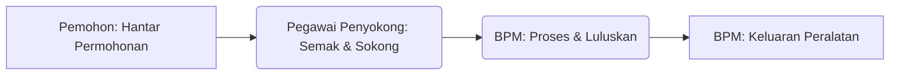

# Sistem Pengurusan Sumber Terintegrasi MOTAC  

Dokumentasi Bahasa Reka Bentuk Versi 4.0 | Untuk Bahagian Pengurusan Maklumat (BPM)
<!-- Dokumen ini memetakan keputusan reka bentuk kepada 18 Prinsip MyGOVEA; rujuk bahagian "Pematuhan MyGOVEA" di akhir. -->

---

## 1. Prinsip Teras Reka Bentuk

### 1.1 Berpaksikan Rakyat (Mesra Pengguna & Jelas)

- **Akses Rakyat:** Reka bentuk aplikasi menempatkan keperluan dan kehendak pengguna sebagai fokus utama. Paparan antara muka, penggunaan menu, mesej dan komponen hendaklah mudah difahami dan relevan.
- **Bahasa Melayu Utama:** Bahasa utama antara muka ialah Bahasa Melayu, dengan pilihan Inggeris secara kontekstual.
- **Penglibatan Pengguna:** Pengguna dilibatkan dalam setiap fasa pembangunan untuk memastikan aplikasi memenuhi keperluan mereka.
- **Memudahkan Pengguna:** Penggunaan navigasi dua klik ke fungsi utama, penandaan medan wajib dengan asterisk merah (*), dan arahan jelas.

### 1.2 Berpacukan Data

- **Pengurusan Data Selamat:** Data diurus secara selamat dan mematuhi undang-undang privasi.
- **Pemodelan Data:** Struktur data dianalisis dan direka supaya mudah difahami dan digunakan pembangun serta pengguna.
- **Perkongsian Data:** Data dikongsi mengikut keperluan, persetujuan dan menambah nilai kepada agensi dan pengguna.

### 1.3 Kandungan Terancang

- **Penyediaan Kandungan:** Kandungan, paparan dan maklumat aplikasi disusun secara jelas, tepat dan terancang agar matlamat perkhidmatan tercapai.
- **Fasa Reka Bentuk:** Meliputi reka bentuk konsep dan seni bina, termasuk integrasi sistem lain dan keselamatan data.

### 1.4 Teknologi Bersesuaian

- **Pilihan Teknologi:** Penggunaan teknologi dan alat pembangunan yang sesuai dengan objektif projek, pengetahuan organisasi dan keselamatan data.
- **Keselarasan Infrastruktur:** Infrastruktur, hosting dan sistem keselamatan dipilih mengikut keperluan aplikasi.

### 1.5 Antara Muka Minimalis dan Mudah

- **Minimalis:** Antara muka direka supaya mudah difahami, bebas komponen tidak perlu, dan navigasi intuitif.
- **Responsif:** Rekaan responsif serta adaptif untuk pelbagai peranti dan saiz skrin.

### 1.6 Seragam

- **Keseragaman:** Penggunaan piawaian konsisten untuk memastikan kualiti, kebolehgunaan dan kebolehoperasian antara modul aplikasi.
- **Penyelenggaraan Mudah:** Piawaian memudahkan kemas kini dan mengurangkan kos pembangunan.

### 1.7 Paparan/Menu Jelas

- **Paparan & Menu:** Elemen dan menu dipaparkan secara konsisten, mudah dikenali, dan memberikan maklum balas yang jelas kepada pengguna.

### 1.8 Realistik

- **Ketepatan Fungsi:** Aplikasi dibangunkan mengikut keperluan sebenar pengguna dan keupayaan teknikal pasukan.
- **Analisis Keperluan:** Pengujian dan penambahbaikan berterusan berdasarkan maklum balas pengguna.

### 1.9 Kognitif

- **Reka Bentuk Kognitif:** Antara muka memudahkan proses kognitif pengguna, mengurangkan beban maklumat berlebihan dan memastikan elemen mudah dikenali.
- **Maklum Balas Visual:** Penggunaan maklum balas visual dan naratif untuk meningkatkan pengalaman pengguna.

### 1.10 Fleksibel

- **Kebolehskalaan & Modular:** Aplikasi mudah diperluas, diperkecil atau diubah suai tanpa menjejaskan prestasi.
- **Konfigurasi & Integrasi:** Pengguna boleh mengubah tetapan aplikasi. Mudah diintegrasi dengan sistem lain melalui API/Web Services.
- **Pengurusan Data Dinamik:** Mudah untuk import, eksport dan transformasi data.

### 1.11 Komunikasi

- **Komunikasi Berkesan:** Proses komunikasi antara pengguna, pasukan pembangunan dan pihak berkepentingan adalah jelas dan terbuka.
- **Pengurusan Perubahan:** Semua perubahan dimaklumkan kepada pihak terlibat untuk mengelakkan konflik.

### 1.12 Struktur Hierarki

- **Susunan Hierarki:** Elemen antara muka diatur secara teratur mengikut hierarki logik untuk memudahkan navigasi dan penggunaan.
- **Contoh E-Dagang:** Halaman utama, produk, troli beli-belah, akaun pengguna dan subsistem berkaitan.

### 1.13 Komponen Antara Muka & Pengalaman Pengguna (UI/UX)

- **Komponen UI:** Butang, input, menu, bar navigasi dan petunjuk digunakan secara konsisten.
- **Pengalaman UX:** Interaksi pengguna, persepsi terhadap aplikasi dan respons emosi diambil kira untuk menjamin kepuasan.

### 1.14 Tipografi

- **Jenis & Saiz Huruf:** Pemilihan jenis huruf, saiz dan jarak antara huruf yang sesuai untuk keterbacaan.
- **Hierarki Visual:** Menggunakan tipografi untuk membentuk hierarki maklumat.

### 1.15 Tetapan Lalai

- **Nilai Lalai:** Penetapan nilai lalai pada konfigurasi, reka bentuk antara muka, keselamatan dan privasi untuk memudahkan penggunaan serta meningkatkan keselamatan.
- **Responsif Peranti:** Tetapan lalai mengambil kira pelbagai dimensi peranti.

### 1.16 Kawalan Pengguna

- **Kawalan Interaktif:** Pengguna diberikan kawalan jelas melalui butang, input, menu dan penunjuk.
- **Konsisten & Mudah Diakses:** Kawalan konsisten, mudah diakses dan sesuai dengan peranti.

### 1.17 Pencegahan Ralat

- **Panduan & Bantuan:** Menyediakan penunjuk dan bantuan jelas untuk elak kesilapan.
- **Pengesahan & Ujian:** Pengesahan tindakan kritikal dan ujian pengguna untuk meningkatkan ketepatan.

### 1.18 Panduan & Dokumentasi

- **Panduan Pembangunan:** Arahan dan prosedur pembangunan, ujian dan pelaksanaan aplikasi.
- **Dokumentasi Teknikal & Pengguna:** Manual pengguna, tutorial, FAQ, sejarah perubahan dan dokumentasi keselamatan.
- **Rujukan SPDK:** Agensi disarankan merujuk dokumen SPDK secara berterusan untuk penambahbaikan.

---

## 2. Asas Visual

### 2.1 Palet Warna

| Peranan      | Mod Cerah           | Mod Gelap   | Penggunaan                                          |
|--------------|---------------------|-------------|-----------------------------------------------------|
| Utama        | #0055A4 (Biru MOTAC)| #3D8FD1     | Butang utama, keadaan aktif, pautan, tajuk.         |
| Sekunder     | #6c757d (Kelabu)    | #adb5bd     | Tindakan sekunder, teks tidak aktif, sempadan.      |
| Aksen        | #E60000 (Merah BPM) | #FF5252     | Ikon grid aplikasi, sorotan, notifikasi segera.     |
| Latar        | #F8F9FA             | #121826     | Latar kandungan utama.                              |
| Permukaan    | #FFFFFF              | #1E293B     | Kad, panel borang, modals.                          |
| Kritikal     | #DC3545              | #F87171     | Ralat, tindakan merosakkan (cth: butang hapus).     |
| Berjaya      | #28A745              | #4ADE80     | Tindakan selesai, mesej kejayaan.                   |
| Amaran       | #FFC107              | #FFD60A     | Status tertunda, amaran berhati-hati.               |

### 2.2 Tipografi

- **Font Utama:** Noto Sans untuk keterbacaan Bahasa Melayu dan Inggeris.
- **Skala:**
  - h1: 1.75rem (28px) • Semibold
  - h2: 1.5rem (24px) • Semibold
  - h3: 1.25rem (20px) • Medium
  - Badan: 0.875rem (14px) • Regular
  - Label: 0.75rem (12px) • Medium
- **Ketinggian Garis:** 1.6 untuk teks badan bagi keterbacaan optimum.

### 2.3 Ikonografi

- **Set Utama:** Bootstrap Icons v1.8+
- **Prinsip Penggunaan:**
  - Ikon digabung dengan label teks untuk kejelasan.
  - Saiz standard: 16px untuk teks, 24px untuk butang.
  - Penggunaan warna semantik (merah untuk hapus, hijau untuk tambah).

---

## 3. Pelaksanaan Jenama

### 3.1 Penggunaan Logo

| Konteks           | Logo               | Format | Spesifikasi                                   |
|-------------------|--------------------|--------|-----------------------------------------------|
| Header Intranet   | MOTAC Intranet     | SVG    | Tinggi 40px, termasuk teks "intranet".        |
| Header Sistem     | MOTAC Rasmi        | SVG    | Tinggi 40px, emblem bulat.                    |
| Footer            | BPM Rasmi          | SVG    | Tinggi 32px, kotak merah berteks putih.       |
| Eksport PDF       | MOTAC Rasmi        | Vektor | Lebar 20mm, di header dokumen.                |
| Templat E-mel     | MOTAC Rasmi        | PNG    | Lebar 120px, dengan alt text yang sesuai.      |

### 3.2 Templat E-mel

- **Struktur:** Gunakan mjml untuk responsif dan konsisten.
- **Penjenamaan:** E-mel bermula dengan header logo MOTAC dan diakhiri footer maklumat penghantar (Bahagian Pengurusan Maklumat).
- **Kandungan:** Subjek jelas, salam formal ("Yang dihormati..."), dan arahan langsung jika respon diperlukan.

---

## 4. Pola Khusus Aliran Kerja

### 4.1 Pengurusan Pinjaman ICT

- **Struktur Borang:** Borang dibahagi kepada bahagian bernombor (BAHAGIAN 1, 2, dst.) mengikut borang rasmi PK.(S).MOTAC.07.(L3).
- **Senarai Semak Peralatan:** Semasa pengeluaran/pulangan, senarai semak aksesori digunakan (Power Adapter, Beg, dll).
- **Aliran Kelulusan:** Sistem memaparkan aliran kelulusan secara visual.

### 4.2 Sistem Helpdesk

- **Struktur Borang:** "Borang Aduan Kerosakan ICT" (PK.(S).MOTAC.07.(L1)), borang satu lajur untuk penyerahan tiket pantas.
- **Paparan Butiran Tiket:** Ringkasan tiket di bahagian atas, diikuti thread komen kronologi antara pengguna & agen IT.
- **Penunjuk Status:** Lencana warna dan ikon jelas untuk status tiket (Buka, Dalam Tindakan, Selesai, Ditutup).

| Status      | Ikon                | Warna      | Label         |
|-------------|---------------------|------------|--------------|
| Buka        | bi-envelope-open    | $utama     | Buka         |
| Dalam Tindakan | bi-arrow-repeat  | $amaran    | Dalam Tindakan|
| Selesai     | bi-check-circle     | $berjaya   | Selesai      |
| Ditutup     | bi-archive          | $sekunder  | Ditutup      |

---

## 5. Pustaka Komponen

### 5.1 Navigasi

- **Navigasi Sisi Menegak:** Menu boleh dilipat, ikon sahaja dipaparkan secara lalai dan kembang semasa hover/pin. Keadaan disimpan dalam localStorage.
- **Bar Tindakan Atas:** Logo MOTAC, notifikasi global, penukar bahasa dan dropdown profil pengguna.

### 5.2 Input Data

- **Medan Borang:** Setiap medan input mesti ada `<label>` dan teks placeholder. Teks bantuan boleh diberikan di bawah medan.
- **Medan Wajib:** Label untuk medan wajib mesti mempunyai asterisk merah: `*`.

### 5.3 Widget Dashboard

- **Kad Statistik:** Digunakan di papan pemuka untuk paparan metrik utama (cth: "Kelulusan Menunggu," "Tiket Terbuka"). Kad visual yang memudahkan pengguna melihat tugas tertunda.

---

## 6. Kebolehcapaian & Tadbir Urus Reka Bentuk

### 6.1 Standard Kebolehcapaian

- **Navigasi Papan Kekunci:** Susunan tab logik dan semua elemen interaktif mesti mempunyai penunjuk fokus jelas (cth: outline biru 3px).
- **Pembaca Skrin:** Gunakan HTML semantik dan label ARIA (cth: `<nav aria-label="Navigasi utama">`).
- **Pengurangan Animasi:** Animasi/transisi mestilah minimum dan menghormati tetapan OS untuk pengurangan gerakan.

### 6.2 Tadbir Urus Reka Bentuk

- **Kawalan Versi:** Token reka bentuk disimpan dalam `design-tokens.json`. Rekod perubahan disimpan dalam `DESIGN_CHANGELOG.md`.
- **Senarai Semak Pematuhan:** Sebelum komponen baru dilepas, ia mesti divalidasi:
  - Teks Bahasa Melayu jelas dan formal.
  - Nisbah kontras WCAG 2.1 AA dipatuhi.
  - Komponen responsif sepenuhnya pada telefon, tablet & desktop.
  - Reka bentuk selaras dengan pola dokumen ini.
  - Penjenamaan MOTAC dan BPM diaplikasi dengan betul.

---

## 7. Pematuhan 18 Prinsip Reka Bentuk MyGOVEA (Ringkas)
- Berpaksikan Rakyat, Berpacukan Data, Kandungan Terancang, Teknologi Bersesuaian
- Antara Muka Minimalis dan Mudah, Seragam, Paparan/Menu Jelas
- Realistik, Kognitif, Fleksibel, Komunikasi, Struktur Hierarki
- Komponen UI/UX, Tipografi, Tetapan Lalai, Kawalan Pengguna
- Pencegahan Ralat, Panduan & Dokumentasi

Semua keputusan reka bentuk dalam dokumen ini disemak melawan prinsip di atas. Rujuk fail prinsip-reka-bentuk-mygovea.md untuk butiran prinsip.

---

*Dokumen diselenggara oleh Pejabat Reka Bentuk BPM*  
*Kemaskini terakhir: 13 Ogos 2025*
