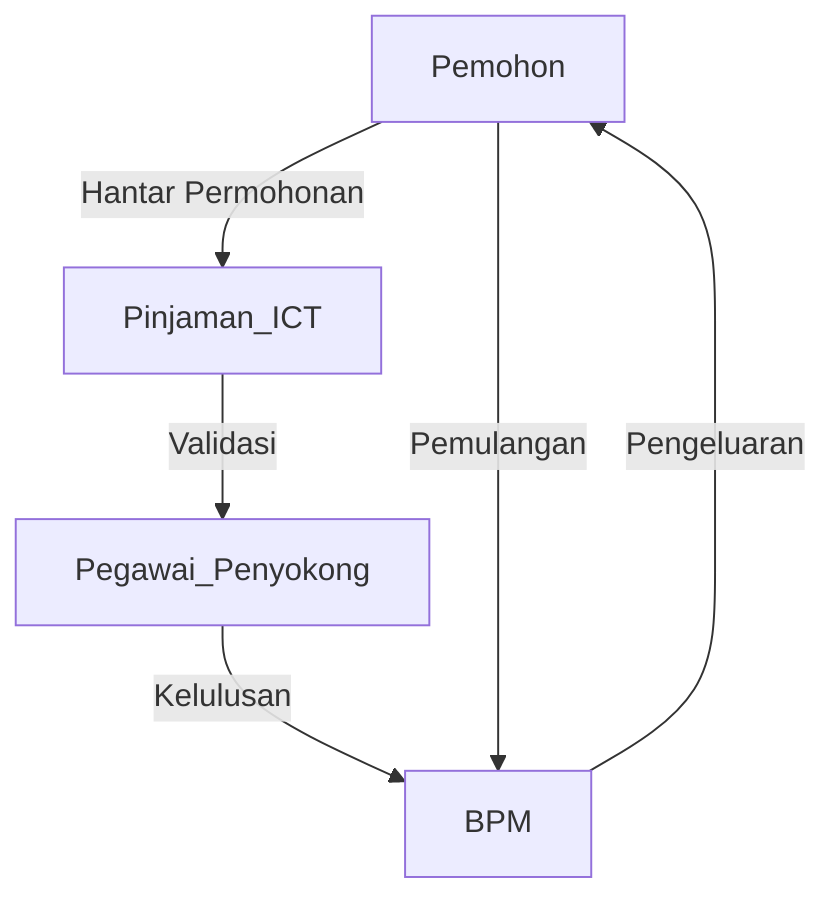

# MOTAC IRMS BRS: Extensive Diagram Planning

This plan details all diagrams (rajah) to be included in the BRS for the Sistem Pengurusan Sumber Terintegrasi MOTAC (IRMS), ensuring full coverage of workflows, functions, business architecture, data structure, and compliance with MYDS/MyGovEA. Each diagram type is mapped to its purpose, recommended tools, and source data for drafting.

---

## 1. **Functional Hierarchy & Business Architecture Diagrams**

### **Rajah 1: Functional Hierarchy Diagram (Hierarki Fungsi Bisnes IRMS)**
- **Purpose:** Visualize top-level modules and submodules: Pinjaman ICT, Helpdesk, Admin, Notification, Reporting.
- **Contents:** Tree showing IRMS → Main Modules → Submodules → Key Functions.
- **Recommended Tool:** Draw.io, Lucidchart, Mermaid (markdown).
- **Source Data:** BRS Section 2.2 & 4.1, system module list.

### **Rajah 2: Business Architecture Overview (Arkitektur Bisnes)**
- **Purpose:** Show relationships between business units, workflows, and supporting systems.
- **Contents:** Boxes for business units (BPM, IT, User, Admin) with arrows for main processes and data flows.
- **Recommended Tool:** Draw.io, Visio.
- **Source Data:** BRS Section 2.2, stakeholder mapping, process overview.

---

## 2. **Use Case Diagrams**

### **Rajah 3: Use Case Diagram - Pinjaman ICT**
- **Purpose:** Model actors (Pemohon, Penyokong, BPM) and their interactions for equipment loan.
- **Contents:** Stick figures for actors, ovals for use cases (Apply, Approve, Issue, Return).
- **Recommended Tool:** Lucidchart, Mermaid, PlantUML.
- **Source Data:** BRS Section 4.1, actor and process list.

### **Rajah 4: Use Case Diagram - Helpdesk**
- **Purpose:** Model actors (User, IT Admin, IT Agent) and workflow for support tickets.
- **Contents:** Actors linked to use cases (Create Ticket, Assign, Resolve, Close).
- **Recommended Tool:** Lucidchart, Mermaid, PlantUML.
- **Source Data:** BRS Section 4.1, actor and process list.

### **Rajah 5: Use Case Diagram - Notification & Reporting**
- **Purpose:** Illustrate how notifications and reports are triggered and consumed.
- **Contents:** Actors (User, Admin, BPM), use cases (Receive Notification, View Report).
- **Recommended Tool:** Lucidchart, PlantUML.
- **Source Data:** BRS Section 8, notification triggers.

---

## 3. **Workflow & Process Flow Diagrams**

### **Rajah 6: Workflow - Pinjaman ICT**
- **Purpose:** Detailed step-by-step flow from application to return.
- **Contents:** Flowchart: Start → Apply → Validate → Approve → Issue → Return → End.
- **Recommended Tool:** Mermaid (markdown), Draw.io, Lucidchart.
- **Source Data:** BRS Section 4.2, workflow breakdown.

### **Rajah 7: Workflow - Helpdesk Ticket**
- **Purpose:** Detailed ticket lifecycle: creation, triage, assignment, resolution, closure.
- **Contents:** Flowchart: Create → Assign → Work → Resolve → Close.
- **Recommended Tool:** Mermaid, Draw.io.
- **Source Data:** BRS Section 4.2, process list.

### **Rajah 8: Approval Workflow**
- **Purpose:** Show approval routing based on grade, decision points, escalations.
- **Contents:** Flowchart with decision branches (if grade insufficient, escalate).
- **Recommended Tool:** Draw.io, Mermaid.
- **Source Data:** BRS Section 4.1, approval rules.

---

## 4. **Entity Relationship & Data Architecture Diagrams**

### **Rajah 9: Entity Relationship Diagram (ERD)**
- **Purpose:** Show data structure, entity relationships, key attributes.
- **Contents:** Boxes for entities (User, Equipment, LoanApplication, HelpdeskTicket, Approval, Notification), lines for relationships (1-to-many, etc).
- **Recommended Tool:** Draw.io, Lucidchart, ERD tools.
- **Source Data:** BRS Section 6, entity list.

### **Rajah 10: Data Architecture Overview**
- **Purpose:** High-level view of data flows between modules, databases, external systems.
- **Contents:** Data stores, APIs, module connections.
- **Recommended Tool:** Draw.io.
- **Source Data:** BRS Section 6, system architecture.

---

## 5. **System Context & Integration Diagrams**

### **Rajah 11: System Context Diagram**
- **Purpose:** Position IRMS in relation to users and external systems (e.g., email, analytics).
- **Contents:** Central IRMS box, arrows to external actors/systems.
- **Recommended Tool:** Draw.io, Mermaid.
- **Source Data:** BRS Section 2.3, system boundaries.

### **Rajah 12: Integration Points**
- **Purpose:** Show how IRMS connects to notification/email servers, reporting tools.
- **Contents:** Module boxes, arrows to external services.
- **Recommended Tool:** Draw.io.
- **Source Data:** BRS Section 8, notification mapping.

---

## 6. **Notification Flow Diagrams**

### **Rajah 13: Notification Trigger Flow**
- **Purpose:** Visualize the notification pipeline: event → service → dashboard/email → user.
- **Contents:** Boxes for modules, arrows for notification flow, labels for triggers.
- **Recommended Tool:** Mermaid, Draw.io.
- **Source Data:** BRS Section 8, notification table.

---

## 7. **MYDS UI Component Reference Diagrams**

### **Rajah 14: MYDS Component Adoption**
- **Purpose:** Reference the UI components used (buttons, forms, tables, badges).
- **Contents:** Screenshots/wireframes, component inventory.
- **Recommended Tool:** Figma (for wireframes), Draw.io.
- **Source Data:** BRS Section 3, MYDS documentation.

---

## 8. **Compliance & Checklist Diagrams**

### **Rajah 15: MyGovEA Principles Mapping**
- **Purpose:** Matrix mapping system modules/processes to MyGovEA principles.
- **Contents:** Table/chart showing which principle is met by which part.
- **Recommended Tool:** Table/chart in Draw.io, markdown table.
- **Source Data:** BRS Section 3.2, compliance checklist.

---

## **Diagram Table: BRS Inclusion Reference**

| No. | Diagram Name                    | Purpose/Notes                                | Tool/Format           | Source Section          |
|-----|---------------------------------|----------------------------------------------|-----------------------|------------------------|
| 1   | Functional Hierarchy            | Module & submodule structure                 | Draw.io/Mermaid       | 2.2, 4.1               |
| 2   | Business Architecture           | Unit relationships/workflow overview         | Draw.io               | 2.2                    |
| 3   | Use Case Pinjaman ICT           | Loan module actor interactions               | Lucidchart/Mermaid    | 4.1                    |
| 4   | Use Case Helpdesk               | Helpdesk actor interactions                  | Lucidchart/Mermaid    | 4.1                    |
| 5   | Use Case Notification/Reporting | Notification/report triggers                 | Lucidchart/PlantUML   | 8                      |
| 6   | Workflow Pinjaman ICT           | Step-by-step loan process                    | Mermaid/Draw.io       | 4.2                    |
| 7   | Workflow Helpdesk Ticket        | Ticket lifecycle                             | Mermaid/Draw.io       | 4.2                    |
| 8   | Approval Workflow               | Approval routing & escalation                | Draw.io/Mermaid       | 4.1                    |
| 9   | ERD                             | Data entities and relationships              | Draw.io/Lucidchart    | 6                      |
| 10  | Data Architecture               | Data flow between modules/databases          | Draw.io               | 6                      |
| 11  | System Context                  | IRMS boundaries and external systems         | Draw.io/Mermaid       | 2.3                    |
| 12  | Integration Points              | External service connections                 | Draw.io               | 8                      |
| 13  | Notification Trigger Flow       | Notification event pipeline                  | Mermaid/Draw.io       | 8                      |
| 14  | MYDS UI Components              | UI component adoption (reference/wireframe)  | Figma/Draw.io         | 3                      |
| 15  | MyGovEA Principles Mapping      | Compliance matrix for principles             | Table/Draw.io         | 3.2, 9                 |

---

## **Methodology & Implementation Notes**

- **Draft all diagrams early** as placeholders in the BRS, then replace with finalized versions during design/documentation.
- **Reference each diagram in relevant BRS sections** (e.g., workflow diagrams in Section 4, ERD in Section 6).
- **Use consistent numbering and captions** (Rajah 1, Rajah 2, etc.) for traceability and navigation.
- **Document notation and legend for each diagram type** in a separate table for clarity.
- **Use MYDS UI standards** for wireframes/screenshots where applicable.
- **Store all diagram source files in a dedicated /diagrams or /docs/img folder** for version control and future updates.

---

## **Example Mermaid Diagram (for Markdown Docs)**

---

## **Next Steps**

1. **Create diagram skeletons or drafts for each listed item.**
2. **Add diagram captions and references in the BRS main document.**
3. **Coordinate with design (Figma, Draw.io) for UI components and workflow visuals.**
4. **Review for completeness and compliance before finalizing.**

---

> **Tip:** Always cross-reference diagrams with BRS tables for actors, data entities, processes, and compliance mapping to ensure alignment and completeness.
