# Sistem Pengurusan Sumber Terintegrasi MOTAC (IRMS)  
## Senarai & Rajah Gambaran Sistem (BRS)

Dokumen ini menyenaraikan dan membekalkan kod mermaid untuk setiap rajah utama dalam BRS IRMS, merangkumi hierarki fungsi, use case, aliran kerja, entiti data, dan konteks sistem.  
Setiap rajah disediakan dalam format mermaid untuk mudah diolah/dimasukkan ke dalam markdown, dokumentasi online, atau alat seperti Draw.io/Mermaid Live Editor.

---

## Rajah 1: Hierarki Fungsi Sistem (Functional Hierarchy Diagram)

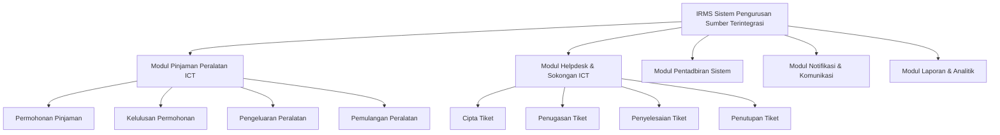
_Komen: Struktur sistem IRMS, pecahan modul dan fungsi utama._

---

## Rajah 2: Arkitektur Bisnes (Business Architecture Overview)

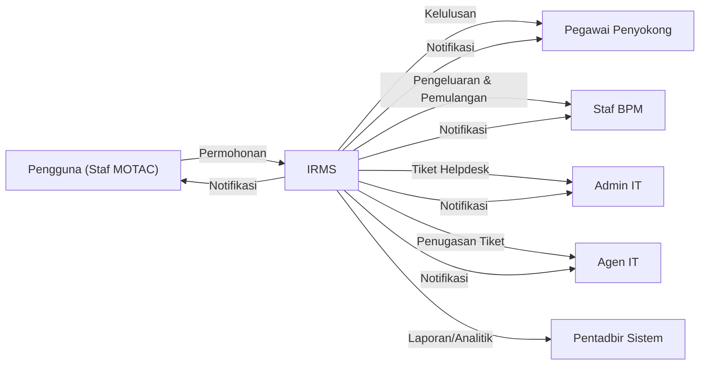
_Komen: Hubungan antara entiti utama dan modul IRMS._

---

## Rajah 3: Use Case Diagram - Pinjaman ICT

```mermaid
usecase
    actor Pemohon
    actor PegawaiPenyokong
    actor BPM
    Pemohon --> (Isi Permohonan Pinjaman)
    Pemohon --> (Semak Status Permohonan)
    PegawaiPenyokong --> (Semak Permohonan)
    PegawaiPenyokong --> (Lulus/Tolak Permohonan)
    BPM --> (Pengeluaran Peralatan)
    BPM --> (Terima Pemulangan Peralatan)
    Pemohon --> (Pemulangan Peralatan)
```
_Komen: Use case utama untuk modul Pinjaman ICT._

---

## Rajah 4: Use Case Diagram - Helpdesk ICT

```mermaid
usecase
    actor StafMOTAC
    actor ITAdmin
    actor ITAgent
    StafMOTAC --> (Cipta Tiket Aduan ICT)
    StafMOTAC --> (Semak Status Tiket)
    ITAdmin --> (Penugasan Tiket)
    ITAdmin --> (Pantau Laporan)
    ITAgent --> (Selesaikan Tiket)
    ITAgent --> (Tutup Tiket)
    StafMOTAC --> (Terima Notifikasi Penyelesaian)
```
_Komen: Use case dan interaksi utama modul Helpdesk._

---

## Rajah 5: Use Case Diagram - Notifikasi & Laporan

```mermaid
usecase
    actor Pemohon
    actor PegawaiPenyokong
    actor BPM
    actor ITAdmin
    actor ITAgent
    actor PentadbirSistem

    Pemohon --> (Terima Notifikasi Permohonan)
    PegawaiPenyokong --> (Terima Notifikasi Permohonan Masuk)
    BPM --> (Terima Notifikasi Pengeluaran/Pemulangan)
    ITAdmin --> (Terima Notifikasi Tiket Masuk)
    ITAgent --> (Terima Notifikasi Penugasan Tiket)
    PentadbirSistem --> (Jana Laporan Analitik)
```
_Komen: Gambaran ringkas interaksi notifikasi dan laporan._

---

## Rajah 6: Workflow Pinjaman ICT

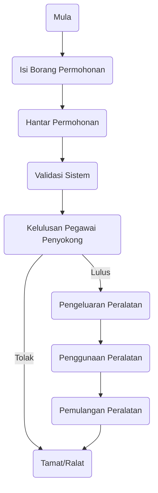
_Komen: Aliran penuh proses pinjaman ICT._

---

## Rajah 7: Workflow Helpdesk Ticket

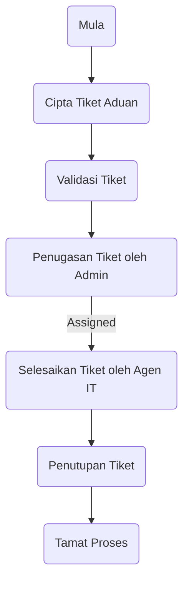
_Komen: Aliran proses dari ciptaan hingga penutupan tiket._

---

## Rajah 8: Workflow Kelulusan (Approval Workflow)

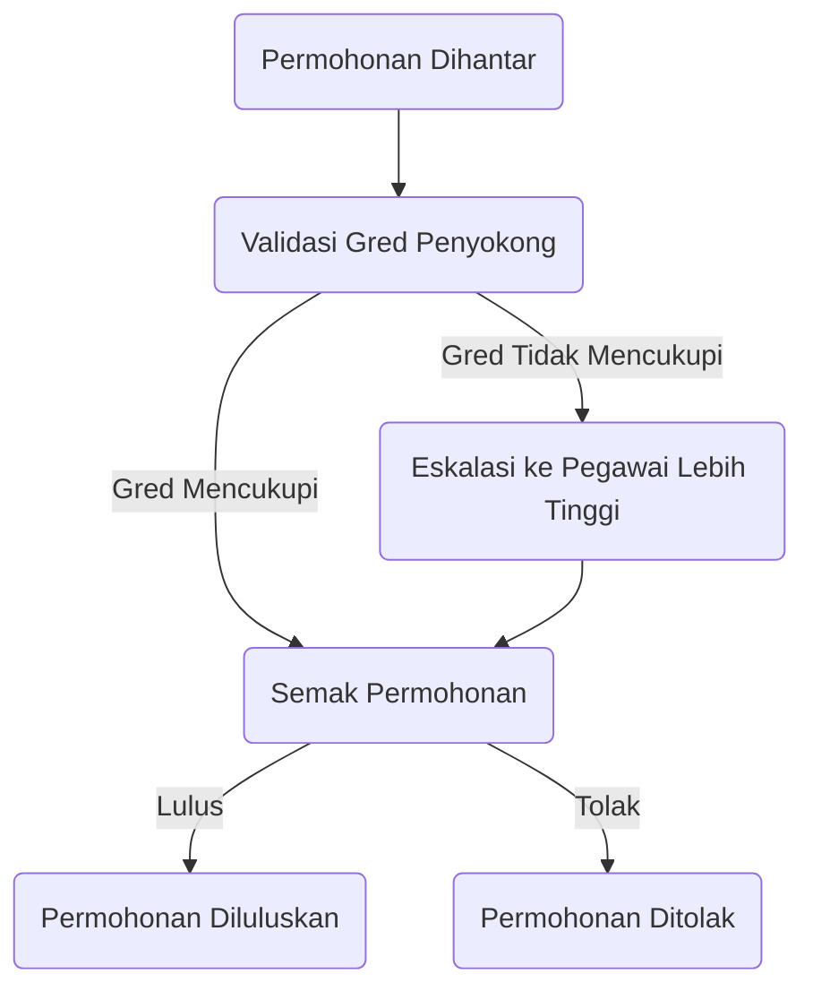
_Komen: Aliran kelulusan berhierarki._

---

## Rajah 9: Entity Relationship Diagram (ERD)

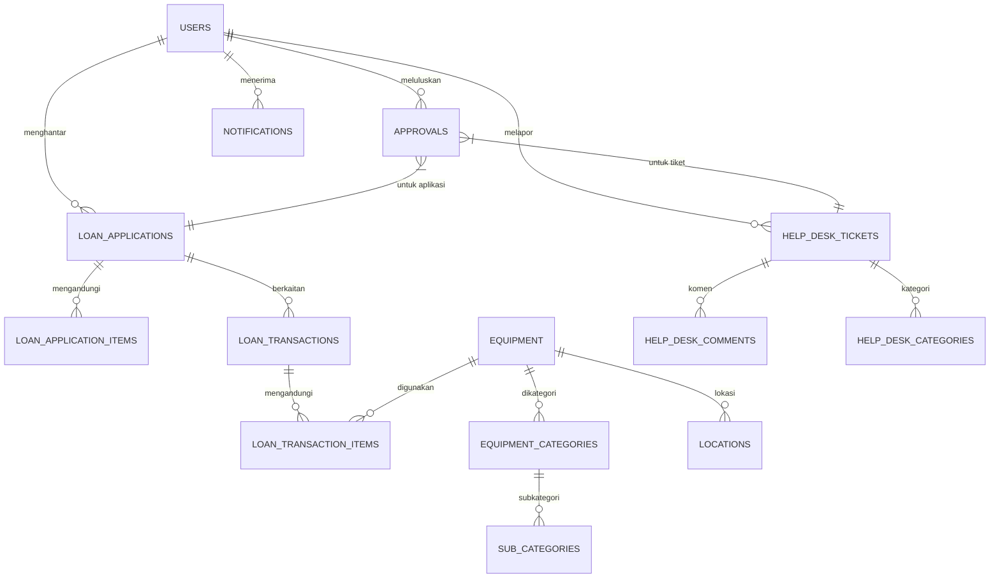
_Komen: Hubungan entiti utama sistem IRMS._

---

## Rajah 10: Data Architecture Overview

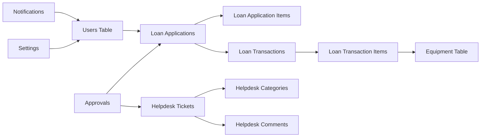
_Komen: Gambaran aliran data dan hubungan jadual utama._

---

## Rajah 11: System Context Diagram

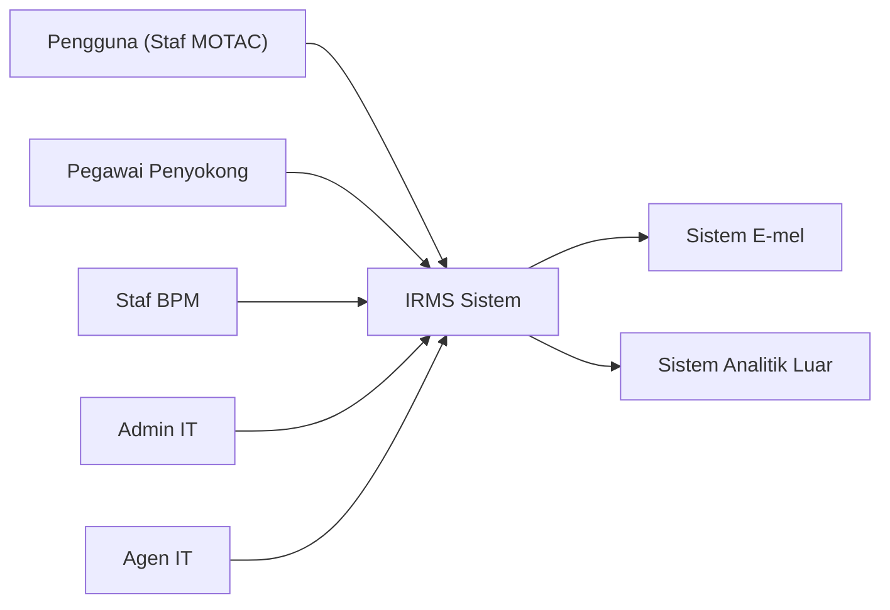
_Komen: Batas sistem IRMS dan integrasi luaran._

---

## Rajah 12: Integration Points Diagram

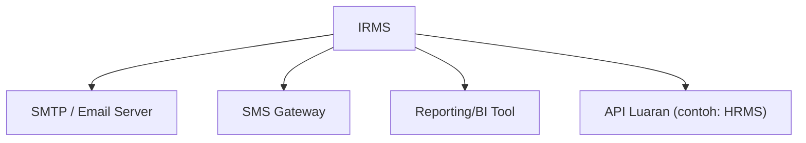
_Komen: Integrasi utama IRMS dengan sistem luaran._

---

## Rajah 13: Notification Trigger Flow

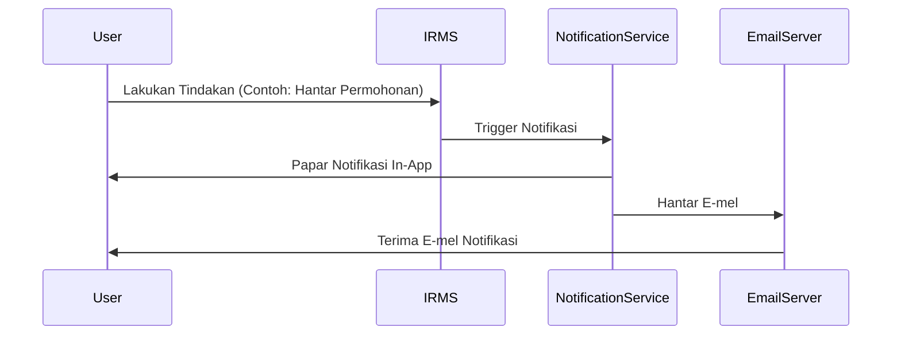
_Komen: Pipeline notifikasi dari event hingga dashboard/email._

---

## Rajah 14: MYDS UI Component Reference

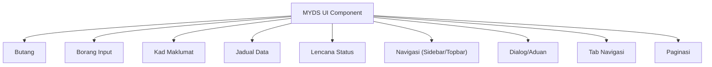
_Komen: Senarai komponen MYDS yang digunakan dalam IRMS._

---

## Rajah 15: MyGovEA Principles Mapping (Compliance Matrix)

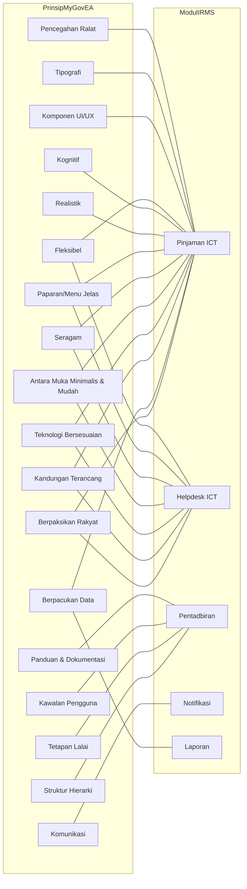
_Komen: Matriks pemetaan prinsip MyGovEA ke modul IRMS._

---

> **Nota:**  
> Semua kod mermaid boleh dimasukkan terus ke dalam markdown, GitHub, Notion, atau mana-mana alat dokumentasi yang menyokong diagram berasaskan teks.  
> Untuk dokumentasi rasmi, setiap rajah perlu dinomborkan dan dirujuk dalam seksyen berkaitan BRS.  
> Rajah boleh diolah/diperkaya mengikut keperluan semasa fasa rekaan atau pelaksanaan.
