# Sistem Pengurusan Sumber Terintegrasi MOTAC (IRMS)
## Senarai & Rajah Gambaran Sistem (SRS)

Dokumen ini membekalkan kod mermaid untuk setiap rajah utama dalam SRS IRMS, merangkumi konteks sistem, hierarki modul, aktor, use case, aliran kerja, data, integrasi, dan pematuhan. Setiap rajah boleh diolah/dimasukkan ke dalam markdown, dokumentasi online, atau alat visual yang menyokong mermaid.

---

## Rajah SRS-1: System Context Diagram

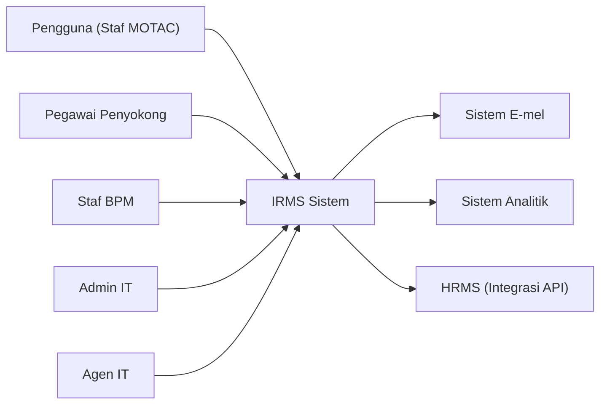
_Komen: Gambaran sistem IRMS dan hubungannya dengan aktor serta sistem luaran._

---

## Rajah SRS-2: Functional/Business Architecture Diagram

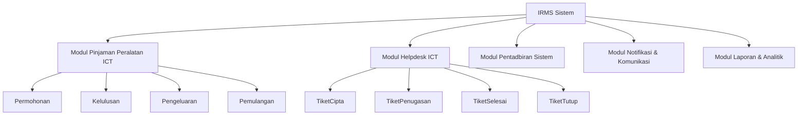
_Komen: Struktur modul dan submodul utama IRMS._

---

## Rajah SRS-3: Actor Diagram

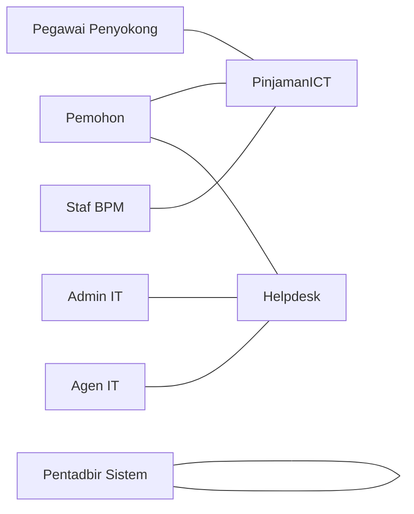
_Komen: Senarai aktor dan pemetaan peranan kepada modul._

---

## Rajah SRS-4: Use Case Diagram – Pinjaman ICT

```mermaid
usecase
    actor Pemohon
    actor PegawaiPenyokong
    actor BPM
    Pemohon --> (Isi Permohonan)
    Pemohon --> (Semak Status)
    PegawaiPenyokong --> (Semak Permohonan)
    PegawaiPenyokong --> (Lulus/Tolak)
    BPM --> (Pengeluaran Peralatan)
    BPM --> (Terima Pemulangan)
    Pemohon --> (Pemulangan Peralatan)
```
_Komen: Use case utama modul pinjaman ICT._

---

## Rajah SRS-5: Use Case Diagram – Helpdesk

```mermaid
usecase
    actor StafMOTAC
    actor ITAdmin
    actor ITAgent
    StafMOTAC --> (Cipta Tiket)
    StafMOTAC --> (Semak Status Tiket)
    ITAdmin --> (Penugasan Tiket)
    ITAdmin --> (Pantau Statistik)
    ITAgent --> (Selesaikan Tiket)
    ITAgent --> (Tutup Tiket)
    StafMOTAC --> (Terima Notifikasi)
```
_Komen: Use case utama modul helpdesk._

---

## Rajah SRS-6: Use Case Diagram – Notifikasi & Laporan

```mermaid
usecase
    actor Pemohon
    actor PegawaiPenyokong
    actor BPM
    actor ITAdmin
    actor ITAgent
    actor Admin

    Pemohon --> (Terima Notifikasi)
    PegawaiPenyokong --> (Terima Notifikasi Masuk)
    BPM --> (Terima Notifikasi Pengeluaran/Pemulangan)
    ITAdmin --> (Terima Notifikasi Tiket Masuk)
    ITAgent --> (Terima Notifikasi Penugasan)
    Admin --> (Jana Laporan Analitik)
```
_Komen: Use case notifikasi dan laporan._

---

## Rajah SRS-7: ERD (Entity Relationship Diagram)

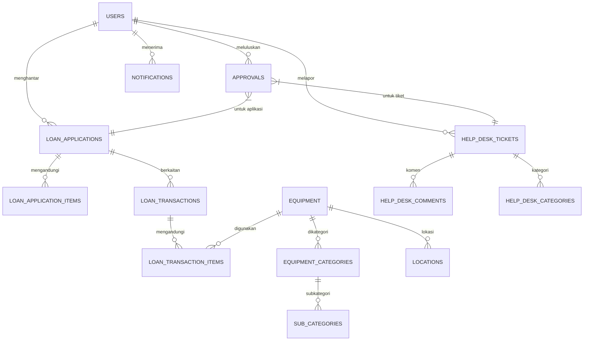
_Komen: Hubungan entiti utama dan data._

---

## Rajah SRS-8: Data Dictionary Table Reference

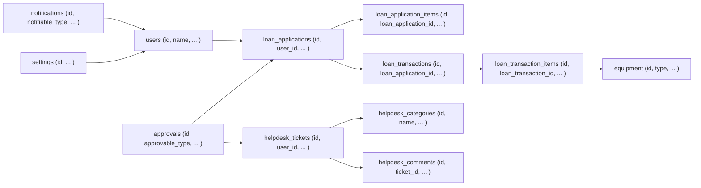
_Komen: Jadual utama dan hubungan (boleh diganti/ditambah jadual detail dalam markdown)._

---

## Rajah SRS-9: Workflow – Pinjaman ICT

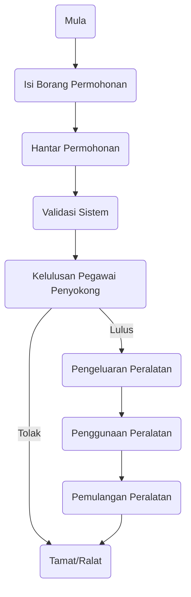
_Komen: Proses lengkap modul pinjaman ICT._

---

## Rajah SRS-10: Workflow – Helpdesk Ticket

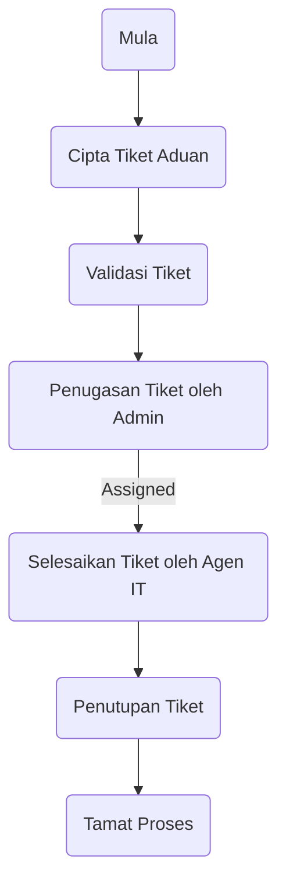
_Komen: Aliran proses tiket helpdesk._

---

## Rajah SRS-11: Approval Routing Diagram

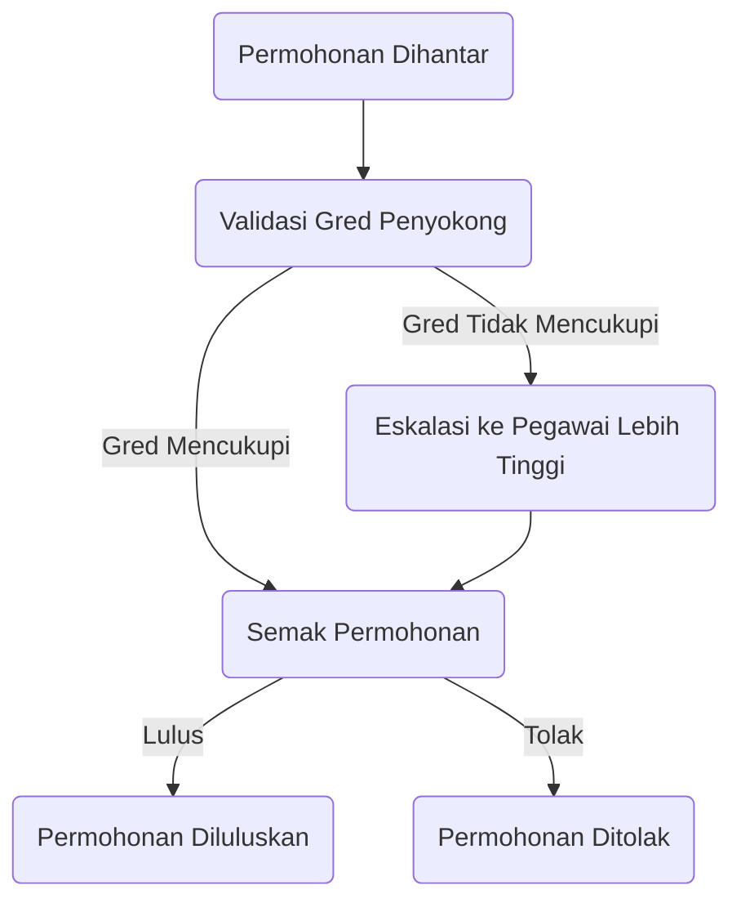
_Komen: Aliran kelulusan berhierarki dan eskalasi._

---

## Rajah SRS-12: DFD – Pinjaman ICT Module

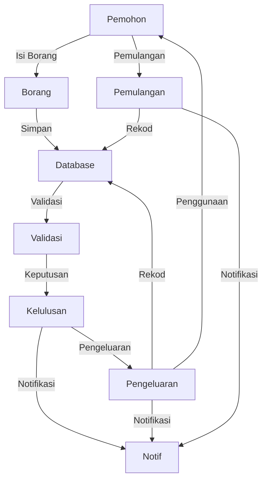
_Komen: Aliran data utama modul pinjaman ICT._

---

## Rajah SRS-13: DFD – Helpdesk Module

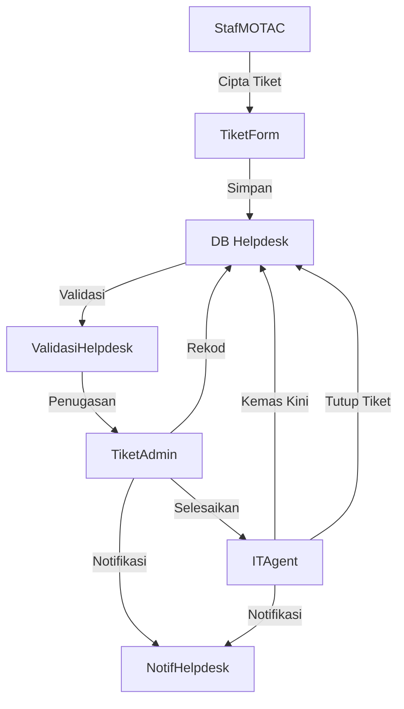
_Komen: Aliran data utama modul helpdesk._

---

## Rajah SRS-14: Integration Points Diagram

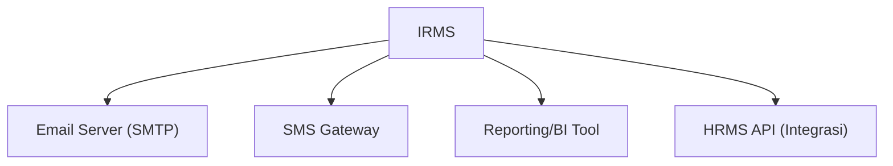
_Komen: Titik integrasi IRMS ke sistem luaran._

---

## Rajah SRS-15: Notification Trigger Flow Diagram

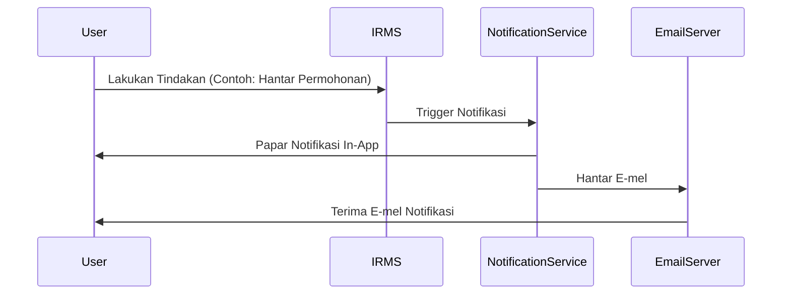
_Komen: Pipeline proses notifikasi dari event hingga pengguna._

---

## Rajah SRS-16: MYDS Component Inventory Reference

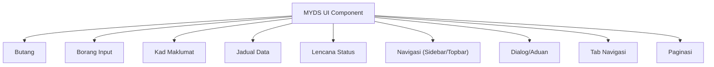
_Komen: Senarai komponen MYDS yang digunakan dalam UI IRMS._

---

## Rajah SRS-17: MyGovEA Principles Compliance Matrix

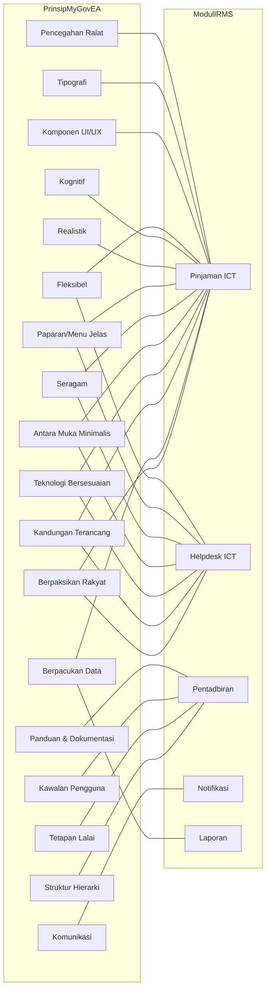
_Komen: Matriks pemetaan prinsip MyGovEA ke modul IRMS._

---

> **Nota:**  
> Semua kod mermaid boleh terus dimasukkan ke dalam markdown, GitHub, Notion, atau mana-mana alat dokumentasi yang menyokong diagram berasaskan teks.  
> Rajah perlu dinomborkan dan dirujuk dalam seksyen berkaitan SRS.  
> Rajah boleh diolah/diperkaya mengikut keperluan semasa fasa design atau pelaksanaan.
